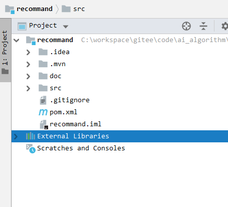

## CRecommend
The java implementation of UserCF and ItemCF, training waste less time, get result data more fast! Has used to be our product project.

the number of 350000 data just used 23min in training. That's cool.

And it has been used in our production, if your app data not so big (below 20 million user log data a day), I think it can let you happy to use it.

> chinese inroduction is below

## How to use
You have undanstand the recommend ItemCF and UserCF algorithm.

CRecommand was implemented by Java and springtoot, Although you have not understood ItemCF or UserCF,  you can easily run and debug this project. 

- clone this project, execute this command in terminal `git clone https://github.com/NihaoRay/CRecommend.git`

- use IDE start `recommand` fold, I hope you can use IDEA start recommand fold. Then, idea will be like this image.



- before run this project, you show configure   `RecommandApplication.java`. 

you should tell this method properly original training data address, like this code. Have done this, you can run this project.

```java
String filePath = "C:\\Users\\chenrui\\Desktop\\test.csv";
readCsv.readWithCsvBeanReader(filePath);
```

- training data is saved in Mongodb, **you must install Mongodb**

## CRecommend
基于UserCF和ItemCF协同过滤推荐算法Java实现，在训练数据时，25万条在23分钟训练完成，商品稀疏矩阵占用更少的内存，在训练的过程中就已经排序完成。

使用Java springboot实现，能够更容易的扩展更容易的修改相关功能。该项目已经应用在我们的项目组，尤其对于我们这种节约成本的小组又希望有一个可靠的推荐算法，是一个福音，代码简单，训练数据的速度非常可观。

## 使用启动方式

- 将代码clone下来放到特定位置

- 用idea启动remmond那个目录，那个就是推荐算法项目，springboot的项目

- 你需要配置 `RecommandApplication` 该类，指定csv训练数据的地址，然后就能启动运行了。

- 训练数据保存在mongodb中，你还需要安装一个Mongodb数据库